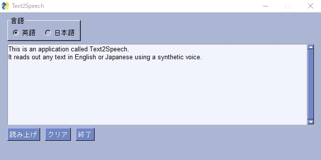

# Text2Speech GUI Application

## 概要

Text to speechのGUIアプリケーションです。

英語、日本語による任意の文章を合成音声で読み上げてくれます。

- 実行画面例

　

## 環境

- Windows10 Pro 64bit
- Python 3.8.15
- PySimpleGUI 4.60.4
- gTTS 2.3.0
- pygame 2.1.2

## 使い方

1. リポジトリ内のReleaseから`Source code (zip)`、あるいは`Source code (tar.gz)`をダウンロードし、解凍します。

   また、`git`コマンドを使用する場合は、`git clone`でソースコードをダウンロードします。

   ```shell
   $ git clone https://github.com/kumanuron-1910/Text2Speech.git
   ```

2. `dist`ディレクトリ内の`text2speech.exe`を実行します。

3. 読み上げる文章の言語（英語 or 日本語）を選択し、任意の文章を入力します。
4. 文章入力後、「読み上げ」ボタンをクリックすることで、文章を読み上げてくれます。
   
   また、「クリア」ボタンをクリックすることで、入力した文章を削除することができます。

5. アプリを閉じたい場合は、「終了」ボタン、あるいはウィンドウの×をクリックします。

## 備考

- Windows環境のみ動作検証済みです。
- Mac or Linuxで使用したい場合は、直接ソースファイルの実行（`$ python3 text2speech.py`）をおすすめします。
